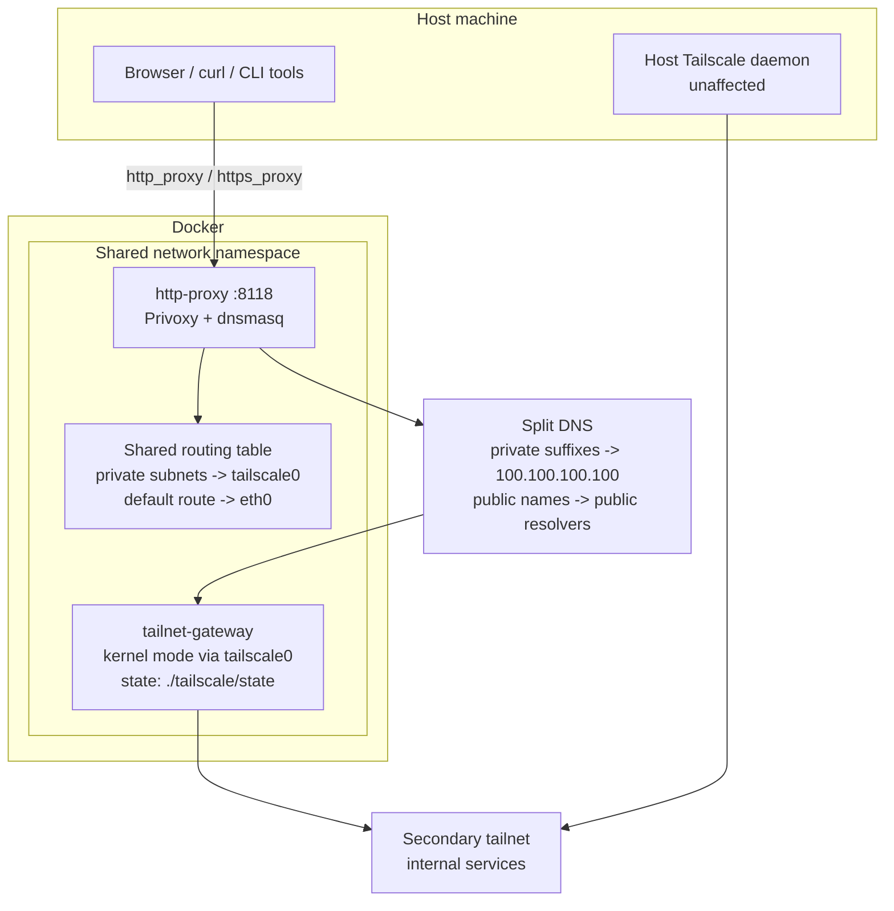

# tailbridge - Secondary Tailnet Bridge via Docker Compose

## Overview

`tailbridge` routes private internal domain names through a secondary Tailscale
tailnet without touching host DNS, host routing tables, or requiring elevated
permissions in the tailnet itself.

Everything runs inside Docker. The host only needs proxy environment variables
that point selected tools at the local HTTP proxy.

Platform support: Linux only. The Tailscale container runs in kernel mode and
needs `/dev/net/tun` plus `NET_ADMIN`. This setup is not intended for Docker
Desktop on macOS or Windows.

---

## Architecture



### Traffic flow

1. An app sends an HTTP or HTTPS request.
2. Proxy environment variables route it to Privoxy at `127.0.0.1:8118`.
3. `dnsmasq` inside `http-proxy` resolves names using split DNS:
   - private DNS suffixes such as `.corp` go to Tailscale DNS
     `100.100.100.100`
   - public domains go to configurable public resolvers
4. Privoxy connects `DIRECT` to the resolved IP.
5. The shared kernel routing table selects the interface:
   - private subnets go through `tailscale0`
   - public traffic goes through the container's normal default route
6. HTTPS passes through HTTP `CONNECT`; there is no TLS interception.

### Why dnsmasq?

Tailscale's DNS proxy (`100.100.100.100`) is reached through `tailscale0`, not a
local listener. Without local caching and split-DNS logic, DNS latency spikes can
stall all lookups and cause public traffic to feel unreliable. `dnsmasq` keeps a
local cache, sends private suffixes through the tunnel, and sends public lookups
directly to public resolvers.

---

## Directory structure

```text
tailbridge/
|- README.md                   # This file
|- docker-compose.yml          # Service definitions
|- Makefile                    # Convenience targets
|- .env.example                # Safe config template - copy to .env
|- .env                        # Your local config (gitignored)
|- .gitignore                  # Ignores local secrets and runtime state
|- privoxy/
|  |- Dockerfile               # Alpine + privoxy + dnsmasq
|  |- entrypoint.sh            # Starts dnsmasq then privoxy
|  `- config                   # Privoxy config (DIRECT for all traffic)
|- tailscale/
|  `- state/                   # Persisted Tailscale auth state (only .gitkeep is committed)
|     `- .gitkeep
`- scripts/
   |- add-domain.sh            # Add a private DNS suffix
   |- doctor.sh                # Automated health checks
   |- login.sh                 # First-run login helper
   `- status.sh                # Human-readable status summary
```

---

## Configuration

Copy the template:

```bash
cp .env.example .env
```

### Parameters

| Variable | Default | Description |
|---|---|---|
| `PRIVOXY_PORT` | `8118` | Host-side port exposed on `127.0.0.1`. Privoxy listens on port `8118` on all container interfaces so Docker can forward the host port into the shared network namespace. |
| `PRIVATE_DNS_SUFFIXES` | `corp` | Space-separated private DNS suffixes resolved through Tailscale DNS. Examples: `corp`, `internal`, `private.example.com`. |
| `PUBLIC_DNS_PRIMARY` | `8.8.8.8` | Primary public resolver used by `dnsmasq` for non-private domains. |
| `PUBLIC_DNS_SECONDARY` | `1.1.1.1` | Secondary public resolver used by `dnsmasq` for non-private domains. |
| `TAILNET_DNS_SERVER` | `100.100.100.100` | DNS server used for private suffix resolution through the tailnet. |
| `TS_LOGIN_SERVER` | _(unset)_ | Custom Tailscale control plane URL for Headscale or another compatible control plane. |
| `TS_VERSION` | `stable` | Tailscale image tag. Pin this to a specific version if you want deterministic upgrades. |

Legacy note: `WORK_TLDS` is still accepted during migration, but `PRIVATE_DNS_SUFFIXES`
is now the canonical variable.

### Tailscale container variables

These stay in `docker-compose.yml` and usually do not need edits:

| Variable | Value | Description |
|---|---|---|
| `TS_USERSPACE` | `false` | Kernel mode, required for subnet routing. |
| `TS_STATE_DIR` | `/var/lib/tailscale` | Persisted auth state mounted from `./tailscale/state`. |
| `TS_ACCEPT_DNS` | `true` | Applies tailnet DNS settings inside the container. |
| `TS_EXTRA_ARGS` | `--accept-routes` | Accepts subnet routes advertised by the secondary tailnet. |

---

## Safe to publish

- Commit `.env.example`; keep your real `.env` local and untracked.
- Commit `tailscale/state/.gitkeep`; keep live Tailscale auth state, caches, and logs out of git.
- If you already authenticated locally, review `git status --ignored` before pushing anywhere public.

---

## Quick start

### 1. Configure

```bash
cp .env.example .env
# Edit PRIVATE_DNS_SUFFIXES to match your internal suffixes
```

### 2. Start

```bash
make up
```

### 3. Authenticate (first run only)

```bash
make login
```

This prints a Tailscale login URL. Open it and sign in. The session persists in
`./tailscale/state/`, stays local to your machine, and survives container restarts.

### 4. Configure your shell

Add to your shell profile:

```bash
export http_proxy=http://127.0.0.1:8118 https_proxy=http://127.0.0.1:8118 no_proxy=localhost,127.0.0.1,::1
```

Reload your shell, then verify:

```bash
make test
make status
make doctor
curl http://somehost.internal.corp
```

---

## How to make changes

### Add a private DNS suffix

```bash
make add-domain DOMAIN=internal
```

This appends `internal` to `PRIVATE_DNS_SUFFIXES` in `.env` and restarts the
HTTP proxy service.

You can also edit `.env` directly:

```bash
PRIVATE_DNS_SUFFIXES=corp internal private.example.com
```

Then restart the proxy:

```bash
docker compose restart http-proxy
```

### Remove a private DNS suffix

Remove the suffix from `PRIVATE_DNS_SUFFIXES` in `.env`, then restart:

```bash
docker compose restart http-proxy
```

### Change the host-side proxy port

```bash
PRIVOXY_PORT=9118
```

Then update your shell environment variables and run:

```bash
make restart
```

### Change public resolvers

```bash
PUBLIC_DNS_PRIMARY=9.9.9.9
PUBLIC_DNS_SECONDARY=1.1.1.1
```

Then restart the proxy:

```bash
docker compose restart http-proxy
```

### Use a custom Tailscale control plane

```bash
TS_LOGIN_SERVER=https://your.headscale.host
```

Then restart the stack:

```bash
make restart
```

---

## Migrating an existing setup

If you already have the old stack running, the goal is to preserve auth state and
avoid a fresh login.

1. Back up local state once:
   ```bash
   cp .env .env.backup
   cp -a tailscale/state tailscale/state.backup
   ```
2. Merge new variables from `.env.example` into `.env`:
   - add `PRIVATE_DNS_SUFFIXES` if missing
   - add `PUBLIC_DNS_PRIMARY` and `PUBLIC_DNS_SECONDARY` if desired
   - add `TAILNET_DNS_SERVER` if you want it explicit
   - remove old `WORK_DNS` once you no longer need it
3. Preserve your existing suffix list:
   - if `.env` currently uses `WORK_TLDS`, copy its value into `PRIVATE_DNS_SUFFIXES`
4. Rebuild and restart:
   ```bash
   docker compose down
   docker compose up -d --build
   ```
5. Verify:
   ```bash
   make doctor
   make status
   ```

Changing service names will recreate containers, but keeping `./tailscale/state`
preserves the Tailscale identity in normal cases.

---

## Porting to another machine

### Pack up

```bash
make down
```

Copy the directory as-is, but do not reuse `tailscale/state/` on another host.

### Set up on the new machine

Prerequisites: Docker Engine, Docker Compose v2, and `make`.

```bash
cp -r tailbridge/ ~/projects/tailbridge
cd ~/projects/tailbridge
mkdir -p tailscale/state
cp .env.example .env
make up
make login
```

---

## Troubleshooting

### `make login` shows no URL

The container may already be authenticated. Check:

```bash
make status
docker logs tailnet-gateway | grep -E '(login|auth|100\.)'
```

If state is corrupted:

```bash
make clean && make up && make login
```

### Private domains do not resolve

1. Check `PRIVATE_DNS_SUFFIXES` in `.env`
2. Confirm Tailscale is connected: `make status`
3. Test dnsmasq inside the proxy container:
   ```bash
   docker exec http-proxy nslookup somehost.corp
   ```
4. Test tailnet DNS directly:
   ```bash
   docker exec tailnet-gateway nslookup somehost.corp 100.100.100.100
   ```
5. Check accepted routes:
   ```bash
   docker exec tailnet-gateway ip route show table 52
   ```

### Public domains fail through the proxy

Verify that `dnsmasq` is running and the resolver config is local:

```bash
docker exec http-proxy ps | grep dnsmasq
docker exec http-proxy cat /etc/resolv.conf
docker exec http-proxy nslookup example.com
```

### `curl` ignores the proxy

Some tools require both lowercase and uppercase variables:

```bash
export http_proxy=http://127.0.0.1:8118
export HTTP_PROXY=http://127.0.0.1:8118
export https_proxy=http://127.0.0.1:8118
export HTTPS_PROXY=http://127.0.0.1:8118
```

### Browsers do not use the proxy

Browsers usually ignore shell proxy variables. Configure them directly or use the
desktop environment's proxy settings.

---

## Notes for agents

- Entry point: `docker-compose.yml`
- Private suffix routing: `PRIVATE_DNS_SUFFIXES` in `.env`
- Legacy compatibility: `WORK_TLDS` is still supported during migration
- Auth state: `tailscale/state/` (commit `.gitkeep` only)
- No secrets should be committed; `.env` and live state stay gitignored
- Changing DNS suffixes only requires restarting `http-proxy`
